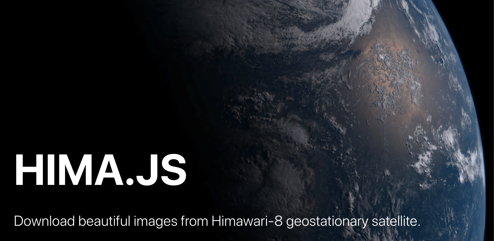

> Based off of [himawari.js](https://github.com/jakiestfu/himawari.js/)

## Highlights

- Promise API
- TypeScript Support
- Actively Maintained

## Install

```bash
$ npm install --save hima
```

## Usage

```js
import { hima } from 'hima'

hima({
  zoom: 1,
  batchSize: 20,
  date: new Date(1581638400000), // 2020/02/14
  debug: true,
})
  .then(console.log)
  .catch(console.error)

```

### API

#### hima(options?)

##### options

Type: `object`

| key          | default        | type              | description       |
| ------------ | -------------- | ----------------- | ----------------- |
| `date`       | `latest`       | `string` / `date` | Which date?       |
| `zoom`       | `1`            | `number`          | zoom level. 1-3 for IR and 1-5 for color |
| `infrared`   | `false`        | `boolean`         | color image or IR image? |
| `output`     | `./`           | `string`          | Output directory to save image in. |
| `batchSize`  | `20`           | `number`          | How many tiles to download in parallel? If you get `ECONNRESET`, try lowering the `batchSize`. |
| `debug`      | `false`        | 'boolean'         | enable logs?      |
| `timeout`    | `{ connect: 15000, response: 15000, request: 30000 }` | `object`    | [got timeout](https://github.com/sindresorhus/got#timeout)   |

## Development

Checkout the repository locally, then:

```bash
$ npm i
$ npm run dev
```

## Contribute

Help make this package better and future proof.

- Clone the code
- Install dependencies with `npm i`
- Create a new branch with `git checkout -b new_feature`
- Commit your changes and push your branch
- Submit a PR to `master`
